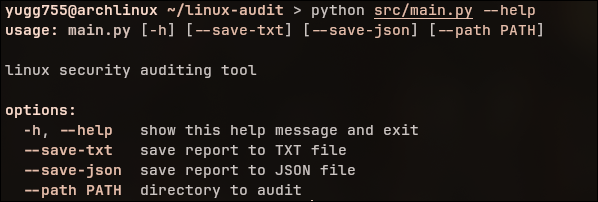
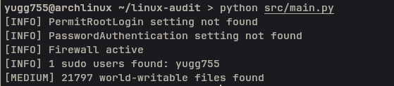

# Linux Audit

A Linux security auditing tool written in Python.

## Overview

Linux Audit scans a Linux system for common security issues and generates a security report.

The goal of this project is to provide a lightweight auditing tool for learning Linux security, Python automation, and basic security assessment techniques.

## Features

* Check SSH root login status
* Check SSH password authentication status
* Check firewall status
* List sudo users
* Detect world-writable files
* Generate terminal reports
* Export reports to TXT format
* Export reports to JSON format

## Project Structure

```text
linux-audit/
├── src/
│   ├── checks.py       # security checks (SSH, firewall, sudo, world-writable)
│   ├── reporter.py     # report generation and TXT/JSON export
│   └── main.py         # CLI entry point
├── reports/            # generated audit reports
├── README.md
└── requirements.txt
```
## Installation

```bash
git clone https://github.com/yugg755i/linux-audit.git

cd linux-audit

python src/main.py
```

## Requirements

* Python 3.10+
* Linux system
* Standard Python libraries only

## Usage

Run the audit:

```bash
python src/main.py
```

Save report as TXT:

```bash
python src/main.py --save-txt
```

Save report as JSON:

```bash
python src/main.py --save-json
```

Save both:

```bash
python src/main.py --save-txt --save-json
```

## Example Output

```text
[HIGH] Root SSH login enabled
[MEDIUM] Password authentication enabled
[INFO] Firewall active
[INFO] 2 sudo users found: admin, user
[MEDIUM] 5 world-writable files found
```

## Screenshots

### CLI usage



### Audit Output



## Stack
- Python 3.10+
- Standard library only (no external dependencies)
